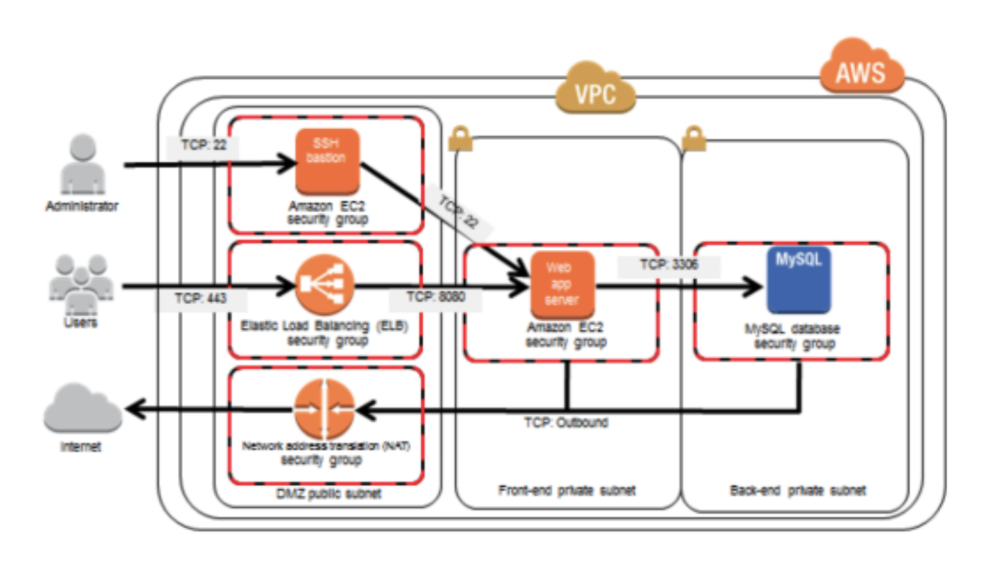

# Terraform Exercise
In this exercise, I implement a given network architecure with terraform.

## Requirements
* terraform
* AWS credentials configured

## Architecture

## Modifications and assumptions
* As I used RDS for the database, both that and the ELB required two different availability zones. Therefore, I decided to double the number of subnets
* To be able to SSH into the instances, I added SSH key creation. Either an existing public key path should be provided, or a new key will be created
* I did not set up a certificate with the ELB, and used HTTP instead of HTTPS protocol, as I did not want to include domain name management
